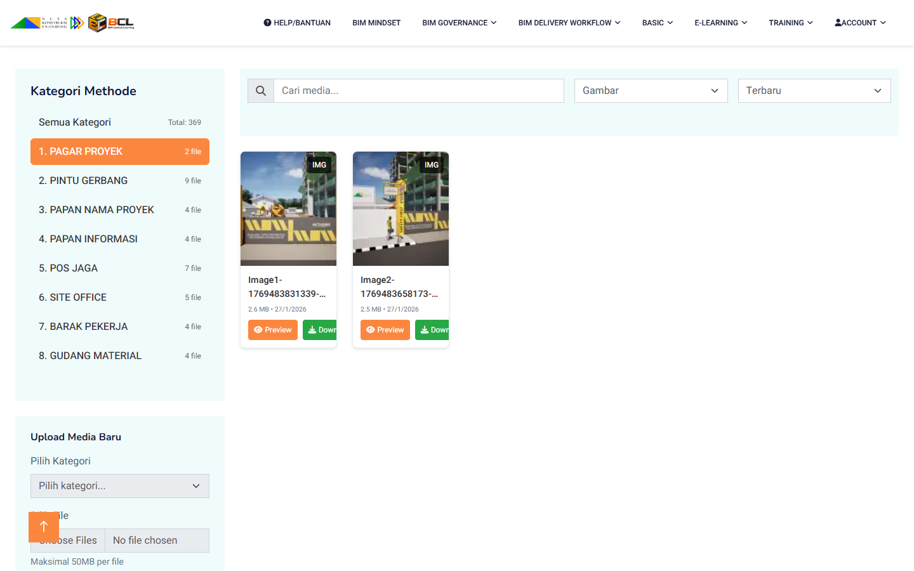
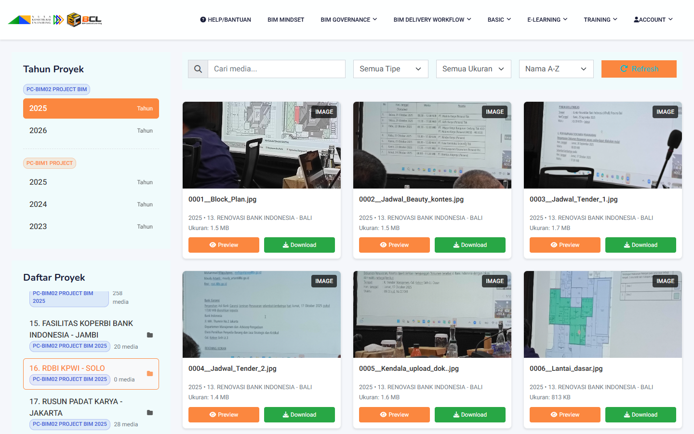
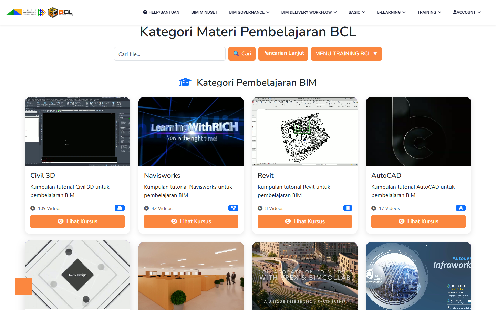

# BIM Central Learning (BCL)

BIM Central Learning (`BCL`) adalah portal pembelajaran, knowledge management, dan eksplorasi konten BIM untuk ekosistem NKE. Aplikasi ini menggabungkan materi pembelajaran, galeri metode kerja BIM, dokumentasi proyek, knowledge assets, dan modul training dalam satu pengalaman web yang terhubung ke backend Node.js dan data internal perusahaan.

## Fungsi Aplikasi

- Menjadi pusat pembelajaran BIM untuk user internal.
- Menyediakan akses ke dokumentasi proyek BIM lintas tahun dan sumber data.
- Menyimpan serta menampilkan media, metode, dan aset knowledge yang bisa dipreview langsung di browser.
- Mendukung training berbasis role, learning path, quiz, dan mapping kompetensi.

## Fitur Andalan

- `Projects Explorer`
  Menampilkan daftar proyek BIM per tahun, daftar project, filter media, preview gambar/video, dan refresh cache project.

- `BIM Methode Gallery`
  Menyediakan galeri metode kerja BIM berbasis kategori, pencarian, filter tipe media, upload file, dan preview media fullscreen.

- `Knowledgehub & Knowledge Assets`
  Menyediakan repositori konten BIM NKE, aset knowledge, library BIM, dan video tutorial dalam satu ekosistem e-learning.

- `Training & Learning Path`
  Menyediakan halaman training, general learning, learning path, dan materi pelatihan berbasis peran BIM.

- `BIM Governance & Delivery Workflow`
  Menyediakan materi tata kelola informasi BIM, peran dan tanggung jawab, quality gate, risk awareness, serta alur delivery BIM end-to-end.

- `Kompetensi & Admin`
  Mendukung mapping kompetensi, pengelolaan akun, login, dan area admin/training management.

## Menu Utama BCL

- `Help / Bantuan`
  Panduan penggunaan aplikasi dan navigasi dasar.

- `BIM Mindset`
  Materi pengantar pola pikir dan fondasi BIM.

- `BIM Governance`
  Materi manajemen informasi, peran, quality gate, risk, audit trail, dan quiz governance.

- `BIM Delivery Workflow`
  Materi peta alur BIM, standar, produksi model, koordinasi, simulasi, deliverables, tools, dan quiz workflow.

- `BASIC`
  Berisi `Index`, `Apa itu BIM?`, `Sumber Daya BIM`, `BIM Standards`, `BIM Plugins & Tools`, dan `BIM News & Updates`.

- `E-Learning`
  Berisi `BIM NKE`, `Projects`, `Video Tutorial`, `BIM Library`, `Knowledge Assets`, dan `BIM Methode`.

- `Training`
  Berisi `General Learning`, `Learning Path`, `Admin`, dan `Mapping Kompetensi`.

- `Account`
  Berisi login, sign up, profile, dan logout.

## Preview Halaman

### BIM Methode

### Projects Explorer

### Training / General Learning

## Catatan

- Dokumentasi ini bersifat ringkas untuk kebutuhan pengenalan repo.
- Detail runtime, startup, PostgreSQL, Nginx, dan operasi sistem tersedia pada file dokumentasi lain di root repo seperti `BCL-HTTP-README.md`, `PHASE4_STARTUP_GUIDE.md`, dan `SYSTEM-OPERATIONAL-GUIDE.md`.
